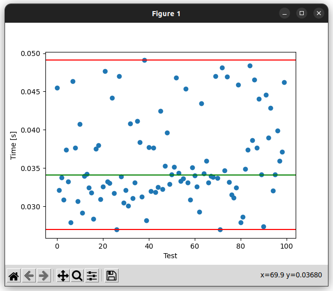

Sistemas Operativos II - Laboratorio III 
###  Ingeniería en Computación - FCEFyN - UNC - 2023
# Laboratorio 3 - Introducción a la programación eficiente y performante

[GitHub repository](https://github.com/ICOMP-UNC/2023---soii---laboratorio-iii-francabrera0)

# Compilación y ejecución de tests

Se generaron una serie de scripts para verificar los diferentes tiempos de ejecución con las mejoras que se irán realizando a lo largo del desarrollo del laboratorio.

Para el análisis de tiempos, podemos utilizar el target `timeTest` del Makefile. Esto nos generará el profiling de 100 ejecuciones del binario con perf, y guardará las correspondientes salidas en un archivo de texto (`./tests/log/timeResults`). Luego un script de python se encargará del postprocesamiento de estos datos.

Para analizar si las modificaciones al código no causaron inconsistencia en el cálculo se modificó la función encargada de llenar la matriz para llenarla toda con unos. Cuando se utiliza el target `computeTest` del makefile, se lanza una ejecución y posteriormente se compara la salida con una salida del programa original, para verificar que no haya problemas en el cálculo.

# Ejecución sin optimizaciones
El valor obtenido nos dará una métrica muy importante, ya que será la base para comenzar a comparar los valores obtenidos con las mejoras que se realizarán.
Los resultados obtenidos fueron:

```
Min:  0.026266979
Max:  0.087808835
Median:  0.034768489
```


Podemos ver que algunos pocos valores son atípicos, esto puede deberse al contexto del procesador al momento de ejecutar el proceso. Si analizamos el archivo en el que se guardan los resultados de cada ejecución podemos encontrar más información.

Para las siguientes optimizaciones, se correrá el test de computo con cada modificación para controlar que no se comentan errores en el cálculo.

# Optimización de la función alloc_matrix
En este caso, se reemplazó el doble for que llamaba a la función memset por un for simple dentro del bucle de arriba.

```c
    for(int i = 0 ; i < XDIM ; i++) {
        array[i] = (double*)malloc((unsigned long)YDIM*sizeof(double));
        if(array[i] == NULL) {
            perror("Could not allocate column");
            exit(EXIT_FAILURE);
        }
        for(int j = 0; j < YDIM; j++) //Nuevo código
            array[i][j] = j;
    }
```

Los resultados obtenidos fueron los siguientes:

```
Min:  0.026377584
Max:  0.138424996
Median:  0.0345098095
```


Esta modificación, no representó una mejora significativa en cuestiones de tiempo.

# Optimización en compute_matrix
En este caso, se eliminaron las variables temporales, quitando así la necesidad del ford que realizaba la suma total y se cambió la operació 2*2/1000 por *0.004. Se obtuvieron los siguientes resultados.

```c
void compute(double** arr, int kern[3][3]) {
    double accum = 0;
    int i, j, k, l;
    for(i = 0 ; i < XDIM ; i++)
        for(j = 0 ; j < YDIM ; j++){
            printf("processing: %d - %d \n", i, j);

            if(i >= 1 && j >=1 && i < XDIM-1 && j <YDIM-1){
                accum = 0;
                for(k = 0; k < 3; k++)
                    for(l = 0; l < 3; l++)
                        accum += (kern[l][k]*arr[i + (l-1)][j + (k-1)])*0.004 + 1;
            }
            arr[i][j] = accum;
        }    
}
```

```
Min:  0.026958989
Max:  0.049089672
Median:  0.034089419999999995
```


Hasta aquí, las mejoras no representan nada significativo.

# Remover función fill
Se movió la funcionalidad de fill a la función alloc_matrix para aprovechar los fors. Entonces al mismo momento que se alloca la memoria, se completa la matriz. Los resultados fueron los siguientes

```
Min:  0.026194362
Max:  0.049184434
Median:  0.034021322500000006
```


Se puede observar, que cada vez se tiene una menor dispersión, y los valores máximos han descendido.

# Uso de valgrind

Al correr el binario con valgrind, obtenemos la salida que nos indica que no se está liberando la memoria que fue allocada, para esto agregamos free().

Al correr el test de tiempos, obtenemos lo siguiente

```
Min:  0.02646243
Max:  0.404673529
Median:  0.0336484675
``` 


Hasta ahora, se ha logrado una mejora de la media de aproximadamente el 3%.

# Modificar el tamaño del buffer
Las mayores penalizaciones de tiempo, se encuentran en las llamadas a printf, esto se nota cuando se comenta la función print por ejemplo. Para disminu la cantidad de llamadas a sistema, inicialmente se intentó utilizar la funsión sprintf para ir escribiendo todo en una string y a lo último imprimirlo pero se tornó un poco complejo. Por lo tanto, se utilizó la función setvbuf. La stdout normalmente es "line buffered" lo cual quiere decir que los caracteres almacenados en el buffer se guardan hasta que se genera una nueva línea o se lee la entrada desde cualquier flujo conectado a una terminal. Mediante la función setvbuf cambiamos el comportamiento de la stdout a "fully buffered", lo cual significa que los caracteres serán guardados hasta que se alcance el tamaño del buffer.

Los resultados obtenidos fueron los siguientes:

```
Min:  0.018068679
Max:  0.083343905
Median:  0.0264180445
```


Esto, representó una mejora del 24% respecto al programa original.

# Análisis de printf

Al comentar las líneas de código en las que se llama a la función printf, se genera una mejora muy notable.

```
Min:  0.001116816
Max:  0.003521441
Median:  0.0013530845
```


Esto representa una mejora del 96%!! Pero perdemos los datos procesados. Por lo tanto, tiene mucho sentido realizar los mayores esfuerzos en optimizar la muestra de los datos (como ya se hizo en el punto anterior). El hecho de colocar la salida en la stdout, puede ser lento e incluso incomodo de leer ya que con una cantidad de datos muy grande se pierden los primeros.

# Salida a un archivo
Se redefinió la función print, para que la salida del cálculo se escriba en un archivo. Con esto, se obtuvieron resultados aproximadamente iguales a los de la salida buffereada completa por la stdout.

```
Min:  0.022167458
Max:  0.849327251
Median:  0.0279103125
```


Ahora, esto nos da un beneficio solamente en cuestiones de legibilidad y posibilidades de post procesamiento, aunque no en tiempos. 

# Quitar la información de "processing"
Este mensaje sólo insume tiempo y no genera ningún beneficio (sólo saber que el programa sigue en ejecución). Podemos intentar quitar esta impresión en cada iteración y por ejemplo sólo colocar un mensaje por cada fila de procesamiento.

Con esto se obtuvieron los siguientes resultados

```
Min:  0.005090718
Max:  0.123007932
Median:  0.007051578
```


Con este cambio, se obtuvo una mejora del 79% respecto al tiempo inicial. Y todavía podemos comprobar que el programa sigue en ejecución.

Por último, podríamos intentar quitar todos los mensajes de processing, dejando sólo uno al inicio y otro al final.

```
Min:  0.004860271
Max:  0.288820769
Median:  0.006208475
```


Esto representa una mejora del 82%.