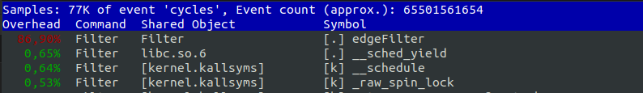
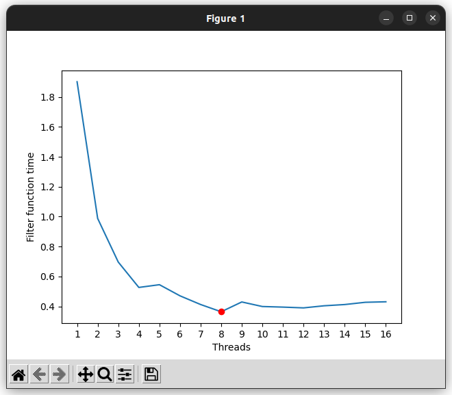

Sistemas Operativos II - Laboratorio III 
###  Ingeniería en Computación - FCEFyN - UNC - 2023
# Laboratorio 4 - HPC - Parallel programing

# Implementación procedular del filtro de borde
En una primera instancia se implementó la convolución del filtro de borde de una manera procedural, de la siguiente manera:

```c
/**
 * @brief Applies the edge filter to the band passed as a parameter
 * 
 * @param band Band to filter
 * @param widht Band widht
 * @param height Band height
 * @return uint8_t* Filtered band
 */
uint8_t* edgeFilter(uint8_t* band, int widht, int height) {
    double accum = 0;
    double data = 0;
    uint8_t* outBand = (uint8_t*)malloc(sizeof(uint8_t)*(size_t)widht*(size_t)height);
    for(int i = 0 ; i < widht ; i++) {
        for(int j = 0 ; j < height ; j++) {
            if(i >= 1 && j >=1 && i < widht-1 && j < height-1) {
                accum = 0;
                for(int k = 0; k < 3; k++) {
                    for(int l = 0; l < 3; l++) {
                        int x = i + (k-1);
                        int y = j + (l-1);
                        data = band[(widht*x)+y];
                        accum += (kernel[k][l]*data);
                    }
                }
            }
            accum = (accum<0) ? 0:accum;
            accum = (accum>255) ? 255:accum;
            outBand[(widht*i)+j] = (uint8_t) accum;   
        }
    }
    return outBand;
}
```

Si analizamos la ejecución del programa podemos dividirlo en tres funciones principales. Inicialmente, mediante la función getRasterBands() se obtienen las bandas R, G y B del archivo .tif que se pasa como argumento. Luego, mediante la función edgeFilter se aplica el filtro a cada una de las bandas. Finalmente, se genera un nuevo archivo .tif con las tres bandas filtradas.


Cómo ejemplo de la salida del filtro, se presenta una sección de la imágen completa para su mejor visualización.

## Profiling
Utilizando perf, podemos observar el tiempo de ejecución del programa y el detalle de cada función particular:


```
 Performance counter stats for './build/Filter ./Sentinel2_20230208T140711_10m.tif':

         18.461,96 msec task-clock                #    1,093 CPUs utilized          
               327      context-switches          #   17,712 /sec                   
                21      cpu-migrations            #    1,137 /sec                   
           279.622      page-faults               #   15,146 K/sec                  
    62.211.841.369      cycles                    #    3,370 GHz                    
   173.354.858.624      instructions              #    2,79  insn per cycle         
    11.548.774.191      branches                  #  625,544 M/sec                  
       164.818.989      branch-misses             #    1,43% of all branches        
   289.245.492.485      slots                     #   15,667 G/sec                  
   179.258.216.211      topdown-retiring          #     60,6% retiring              
    75.430.267.605      topdown-bad-spec          #     25,5% bad speculation       
    17.593.012.308      topdown-fe-bound          #      5,9% frontend bound        
    23.494.753.955      topdown-be-bound          #      7,9% backend bound         

      16,897486518 seconds time elapsed

      16,478610000 seconds user
       1,984941000 seconds sys

```

Podemos ver que el 86.9% del tiempo de ejecución lo consume la función edge filter, por lo tanto es susceptible de ser optimizado.



## Bandera de optimización
Con la misma implementación de la convolución, podemos agregar una bandera de optimización en la compilación y analizar los resultados.

```
 Performance counter stats for './build/Filter ./Sentinel2_20230208T140711_10m.tif':

          7.336,80 msec task-clock                #    1,043 CPUs utilized          
               240      context-switches          #   32,712 /sec                   
                 4      cpu-migrations            #    0,545 /sec                   
           279.680      page-faults               #   38,120 K/sec                  
    25.239.181.806      cycles                    #    3,440 GHz                    
    44.560.801.105      instructions              #    1,77  insn per cycle         
     4.151.331.000      branches                  #  565,823 M/sec                  
       163.745.179      branch-misses             #    3,94% of all branches        
   110.012.224.180      slots                     #   14,995 G/sec                  
    46.249.288.201      topdown-retiring          #     35,9% retiring              
    66.840.325.235      topdown-bad-spec          #     51,9% bad speculation       
    11.551.676.669      topdown-fe-bound          #      9,0% frontend bound        
     4.200.795.487      topdown-be-bound          #      3,3% backend bound         

       7,036680588 seconds time elapsed

       5,447788000 seconds user
       1,893146000 seconds sys
```
Se puede observar que el tiempo bajó aproximadamente a la mitad.

# Implementación con OpenMP
Para la paralelización del cálculo de la convolución, aprovechamos que es un doble for y utilizamos la directiva
```c
    #pragma omp parallel for collapse (2)
```
La cual creará una cantidad de hilos (seteada anteriormente con un valor que se pasa como argumento) y distribuirá el bucle entre ellos. La cláusula collapse indica que se debe colapsar el bucle anidado en un sólo bucle, lo que permite una mayor paralelización y puede mejorar el rendimiento.

Inicialmente, es conveniente comparar los tiempos con la ejecución anterior para el caso que se setee un sólo hilo de ejecución:

```
 Performance counter stats for './build/Filter ./Sentinel2_20230208T140711_10m.tif 1':

          8.197,60 msec task-clock                #    1,237 CPUs utilized          
               146      context-switches          #   17,810 /sec                   
                 7      cpu-migrations            #    0,854 /sec                   
           279.626      page-faults               #   34,111 K/sec                  
    28.626.547.600      cycles                    #    3,492 GHz                    
    54.333.737.044      instructions              #    1,90  insn per cycle         
     4.726.003.288      branches                  #  576,511 M/sec                  
       163.757.396      branch-misses             #    3,47% of all branches        
   126.172.157.990      slots                     #   15,391 G/sec                  
    55.613.976.450      topdown-retiring          #     43,1% retiring              
    55.596.409.379      topdown-bad-spec          #     43,1% bad speculation       
    10.209.440.926      topdown-fe-bound          #      7,9% frontend bound        
     7.530.072.334      topdown-be-bound          #      5,8% backend bound         

       6,626608659 seconds time elapsed

       6,262055000 seconds user
       1,936923000 seconds sys

```
Esto nos dá una salida prácticamente igual a la anterior.

## Medición de tiempo del bloque paralelo
Haciendo uso de la función `omp_get_wtime()` analizaremos el tiempo que tarda cada llamada del bloque paralelizado, la salida es la siguiente:

```
Thread number: 1
Filter Took 1.899898 seconds
Filter Took 1.911511 seconds
Filter Took 1.926963 seconds
```

## Variación de la cantidad de hilos
Podemos aprovechar la salida anterior, para comparar la variación de los tiempos de ejecución en función del número de hilos.
Si realizamos la ejecución del programa con diferentes números de hilos obtenemos la siguiente salida
```
('1', '1.887748', '1.896482', '1.920489')
('2', '0.990622', '0.986665', '0.987194')
('3', '0.696705', '0.693828', '0.699385')
('4', '0.528765', '0.525915', '0.526428')
('5', '0.539591', '0.554343', '0.542099')
('6', '0.464103', '0.482289', '0.466295')
('7', '0.411897', '0.410131', '0.416864')
('8', '0.361910', '0.364629', '0.366983')
('9', '0.434967', '0.440953', '0.413886')
('10', '0.394769', '0.394995', '0.408839')
('11', '0.391861', '0.392942', '0.401870')
('12', '0.390577', '0.388417', '0.392238')
('13', '0.390514', '0.405646', '0.417125')
('14', '0.406819', '0.417737', '0.413564')
('15', '0.413187', '0.437423', '0.432640')
('16', '0.420335', '0.437123', '0.435980')
```


Se puede notar que el mejor rendimiento se da para un número de hilos igual a 8, que coincide con los cores físicos de la PC en la que estoy corriendo el programa.

## Tiempo total para 8 hilos
La salida de perf para la ejecución completa es 
```
 Performance counter stats for './build/Filter ./Sentinel2_20230208T140711_10m.tif 8':

         11.264,94 msec task-clock                #    5,352 CPUs utilized          
               900      context-switches          #   79,894 /sec                   
                 6      cpu-migrations            #    0,533 /sec                   
           279.737      page-faults               #   24,833 K/sec                  
    36.900.171.867      cycles                    #    3,276 GHz                    
    54.062.739.061      instructions              #    1,47  insn per cycle         
     4.688.564.132      branches                  #  416,209 M/sec                  
       164.788.239      branch-misses             #    3,51% of all branches        
    96.357.040.585      slots                     #    8,554 G/sec                  
    55.076.267.037      topdown-retiring          #     53,0% retiring              
    31.139.434.659      topdown-bad-spec          #     30,0% bad speculation       
    11.234.677.820      topdown-fe-bound          #     10,8% frontend bound        
     6.477.665.317      topdown-be-bound          #      6,2% backend bound         

       2,104958134 seconds time elapsed

       9,320034000 seconds user
       1,946336000 seconds sys

```