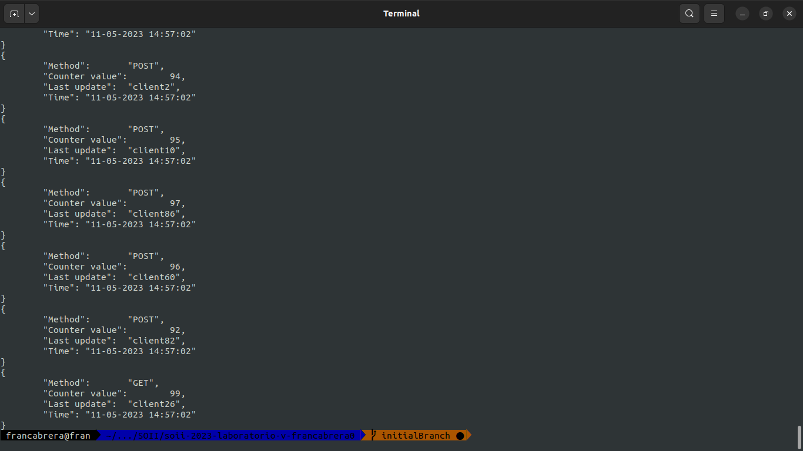
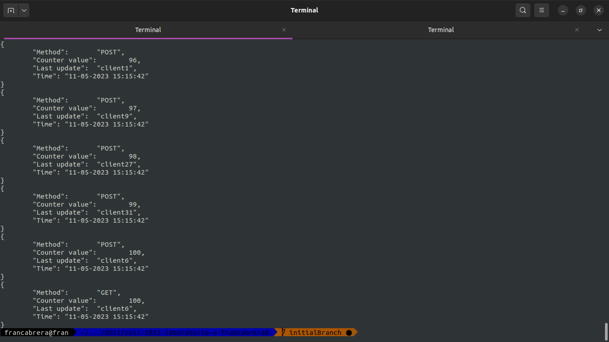

### Laboratorio 5 - Sistemas Operativos II
## Ingeniería en Compitación - FCEFyN - UNC - 2023
# Sistemas Embebidos

[github repo](https://github.com/ICOMP-UNC/2023---soii---laboratorio-iv-francabrera0)

# Compilación y ejecución

Para generar los binarios 

```bash
mkdir build
cd build
cmake ..
make
```

En el directorio build podemos encontrar dos binarios, `Server` y `Client`.

## Server
Para lanzar una nueva instancia del server, basta con ejecutar el binario, pasando como argumento el número de puerto

## Client
Para instanciar un nuevo cliente, se debe pasar como argumentos el nombre del cliente, la dirección (localhost si es local) y el puerto.
Una vez que se inicia, se debe ingresar una opción por la STDIN. Las diferentes opciones son 'g' para realizar un get al server, 'p' para realizar un post y 'e' para terminar la ejecución del cliente.

## Launcher
Para lanzar un server con dos clientes, se puede hacer uso del bash script `launcher.sh` que se encuentra en el directorio raíz.

## Test
Con el bash script `test.sh` que se encuentra en el directorio raíz del proyecto, podemos lanzar un server y seguido a eso, se lanza paralelamente la ejecución de 100 clientes con curl que realizan un método post. Por último, se envía una petición de GET para obtener el estado del contador interno del server.

### Prueba de test sin sicronismo

En este caso, se muestra una ejecución de 100 clientes haciendo incrementos en el contador interno del servidor, el resultado fue el siguiente



Donde al final puede verse que el estado final del contador es 99, y no 100 como debería. Esto es por un problema de concurrencia. Cada vez que se lo ejecuta hay un valor diferente.

### Prueba con sincronismo
Se utilizó un semáforo para sincronizar el acceso a los recursos compartidos, luego de esto se obtuvo la siguiente salida 

