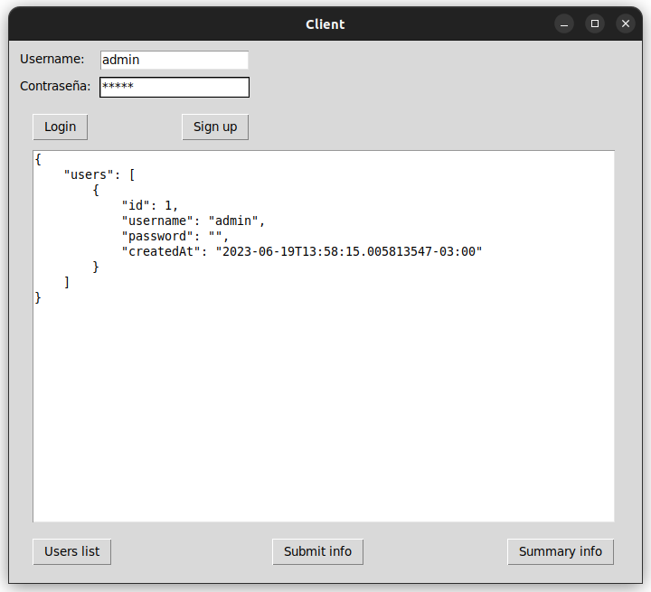

### Lab6 Sistemas Operativos II
## Ingeniería en Compuatación - FCEFyN - UNC
# Sistemas Embebidos

# Dependencias y entorno
Antes de comenzar a usarlo es necesario descargas las dependencias necesarias
- golang
- openssh
- nginx

Además es necesario generar algunas entradas en el archivo /etc/hosts para la resolución de nombres de dominio, estas son:

- 127.0.0.1   dashboard.com
- 127.0.0.1   www.dashboard.com
- 127.0.0.1   sensors.com
- 127.0.0.1   www.sensors.com

# Makefile
En el directorio `server` encontraremos un Makefile con los siguientes targets

## build
Genera el binario a partir del main.go

## run
Compila y ejecuta el servidor (no guarda el binario)

## clean
Borra el archivo binario generado

## start
Este target ejecuta varias instrucciones
- Genera el binario
- Genera el archivo .service para systemd
- Reinicia systemctl
- Configura nginx
- Inicia el servicio del webServer

# stop
Frena el servicio del webServer

# uninstall
Llama a stop y luego eliminar los archivos .service

## deleteUsers
Recorre la base de datos y elimina todos los usuarios del sistema que se encuentren en la misma

## status
Muestra el estado del servicio

## cleanall
Elimina todos los archivos generados y frena todos los servicios

# Ejemplo

## Iniciando el servidor
Para iniciar el servidor, ir al directorio server y ejecutar `make start`

## Client
Se provee en el pryecto un cliente escrito en python que interactua con el servidor para realizar pruebas.

El cliente permite iniciar sesión, crear un usuario, subir información del sistema, ver un listado de usuarios y ver la información de los sensores.

# Errores conocidos
- Los sensores suben información son su username, se debería tomar la id directamente del jwt para que un usuario no pueda subir información con un id que no sea el suyo
- Falta crear usuarios en el sistema para conexión por ssh