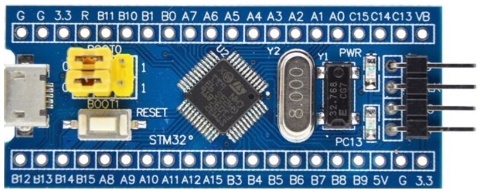
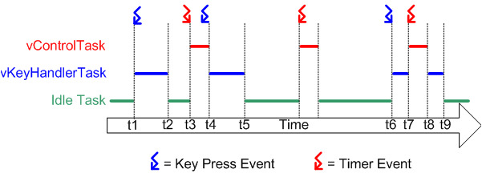
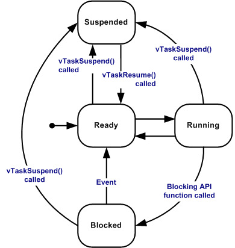
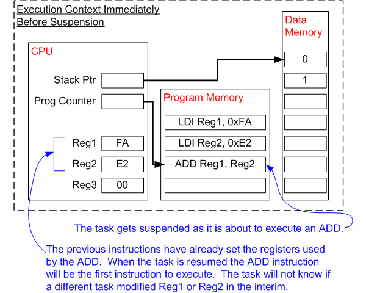
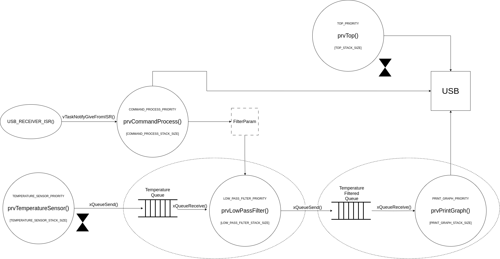

### Laboratorio VII Sistemas Operativos II

## Ingeniería en computación - FCEFyN - UNC

# Laboratorio VII  - Sistemas Operativos II

# Descripción general del proyecto

[GitHub Repository](https://github.com/ICOMP-UNC/2023---soii---rtos-francabrera0)

    En el presente proyecto se desarrolla una aplicación basada en FreeRTOS que representa un sistema de adquisición de temperaturas. La aplicación contará con funcionalidades para:

- Adquirir los valores de temperatura de un sensor

- Aplicación de un filtro pasabajos (Donde cada valor resultante es el promedio de las últimas $N$ mediciones)

- Cambio del valor del $N$ del filtro mediante comandos recibidos por UART

- Gráficos de la temperatura medida en función del tiempo

- Visualización de estadísticas de las tareas (uso de cpu, uso de memoria, etc).

- Cálculo del stack necesario para cada tarea (*uxTaskGetStackHighWaterMark*, *vApllicationStackOverflowHook*) 

## Entorno de desarrollo y herramientas

El proyecto se desarrolla para una STM32f103CBT6

- **Placa de desarrollo:** STM32f103CBT6 Blue Pill

- **Entorno de desarrollo:** STM32CubeIDE 1.13.0

- **ToolChain:** GNU tools for STM32 (based on GNU ARM Embedded toolchain)

- **Debug probe:** ST-LINK V2

- **Kernel:** FreeRTOS kernel V10.0.1

# Introducción a RTOS

    La mayoría de los sistemas operativos parecen permitir que se ejecuten más de un programa al mismo tiempo. Esto se conoce como multitarea. En realidad, cada núcleo del procesador puede correr un sólo hilo de ejecución al mismo tiempo.

    El planificador (o scheduler en inglés) es el componente del SO que es responsable de decidir que proceso debe ejecutarse y cuando debe hacerlo, para proveer una ilusión de simultaneidad de ejecución al intercambiar estos procesos a una gran velocidad.

    El tipo de sistema operativo, es definido por la forma en la que el planificador decide que programa ejecutar.

    El planificador en un RTOS es diseñado para proveer un **patrón de ejecución determinista.** Esto es de mucho interes, particularmente en sistemas reactivos debido a que generalmente estos sistemas tienen requerimientos de tiempo real por su interacción con el medio físico.

    Un requerimiento de tiempo real es aquel que especifica que el sistema debe responder a ciertos eventos dentro de un periodo de tiempo estrictamente definido (deadline). **Sólo se puede garantizar el cumplimiento de los requisitos en tiempo real si se puede predecir el comportamiento del planificador del SO.**

    Tradicionalmente los planificadores de tiempo real logran el determinismo permitiendo que el usuario asigne prioridades a cada hilo de ejecución. El planificador usa este valor de prioridad para determinar cual hilo debe correr primero.

## FreeRTOS

    FreeRTOS es un RTOS diseñado para ser lo suficientemente pequeño para correr en un microcontrolador, sin embargo su uso no está limitado a esta aplicación.

    Los microcontroladores son procesadores con tamaño y recursos reducidos que incorporan en un único chip, el procesador propiamente dicho, una memoria de solo lectura (ROM o Flash) para almacenar el programa que se ejecutará y una memoria de acceso aleatorio (RAM). **Típicamente el programa es ejecutado directamente desde la memoria de sólo lectura.**

    Los microcontroladores son usados en aplicaciones embebidas que normalmente tienen un trabajo muy especifico para hacer. 

    La restricción de espacio y la naturaleza de la aplicación rara vez garantizan el uso de una implementación de un RTOS completo. Por lo tanto, FreeRTOS proporciona la funcionalidad de programación de tiempo real, las primitivas de comunicación entre tareas, temporización y sincronización únicamente. Esto significa que se describe con mayor precisión el kernel del RTOS. 

    Pueden añadirse funcionalidades adicionales, como una interfaz de comandos o stacks de comunicaciones.

## Planificación en FreeRTOS

    [FreeRTOS Scheduling](https://www.freertos.org/single-core-amp-smp-rtos-scheduling.html)

    Por defecto, FreeRTOS utiliza una política de planificación *preferente* con *prioridad fija* con división de tiempos por turnos para tareas de igual prioridad.

     ***Fixed-priority preemptive scheduling policy, with round-robin time-slicing of equal priority tasks.***

- ***Fixed-priory:***  Significa que el planificador no podrá cambiar permanentemente la prioridad de una tarea, sin embargo puede elevar la prioridad de una tarea temporalmente para evitar la inversión de prioridades mediante [herencia de prioridades](https://www.freertos.org/Real-time-embedded-RTOS-mutexes.html).

- ***Preemptive:*** Significa que el planificador siempre ejecutará la tarea de tiempo real de mayor prioridad que está disponible para ser ejecutada, independientemente de cuándo se pueda ejecutar una tarea. Por ejemplo, si una rutina de servicio de interrupción (ISR) cambia el estado de la tarea de mayor prioridad dejandola lista para correr, el planificador frenará la ejecución de la tarea actual (siempre y cuando sea de menor prioridad) y comenzará a ejecutar la de mayor prioridad.

- ***Round Robin:*** Significa que las tareas que comparten nivel de prioridad se turnan de manera rotativa para entrar al estado de ejecución.

- ***Time sliced:*** Significa que el planificador cambiará entre tareas de igual prioridad en cada interrupción de reloj, el tiempo entre dos interrupciones de reloj es un segmento de tiempo (time slice).

### Configuración de la politica de planificación

    En el archivo de configuración `FreeRTOSConfig.h` se encuentran las configuraciones que pueden cambiar el comportamiento del planificador:

- `configUSE_PREEMPTION`
  
  - Si este campo tiene valor 0, entonces el planificador no será preferente y el cambio de contexto solamente ocurrirá si la tarea que se encuentra en ejecución cambia a un estado de bloqueada o suspendida, si la tarea en ejecución llama a [taskYIELD()](https://www.freertos.org/a00020.html#taskYIELD), o si una ISR manualmente solicita un cambio de contexto.

- `configUSE_TIME_SLICING`
  
  - Si este campo tiene valor 0 entonces el segmento de tiempo se desactiva. Por lo tanto el planificador no cambiará entre tareas de igual prioridad en cada interrupción de reloj

## Estados de una tarea

    Una tarea en FreeRTOS puede existir en uno de los siguientes estados:

- **Running:** Cuando una tarea está actualmente en ejecución se dice que está en "Running state". Es la tarea que actualmente está usando el procesador. Si el procesador donde está corriendo el RTOS tiene un sólo núcleo, entonces sólo puede tener una tarea en este estado al mismo tiempo.

- **Ready:** Estas tareas son las que están disponibles para ser ejecutadas (están esperando tiempo de procesador) pero no comienzan a ejecutarse debido a que otra tarea (de igual o mayor prioridad) está actualmente en running state.

- **Blocked:** Se dice que una tarea está en este estado si está actualmente esperando por un evento. Por ejemplo, si una tarea llama a `vTaskDelay()` será bloqueada hasta que el periodo de tiempo termine (evento temporal). Las tareas también pueden ser bloqueadas para esperar por colas, semáforos, eventos de grupos, notificaciones o eventos de semáforos. Las tareas en este modo, normalment tienen un periodo de "timeout", después de este tiempo la tarea es desbloqueada incluso si el evento por el que esperaba no ocurrió.

- **Suspend:** Como las tareas bloqueadas, las suspendidas tampoco pueden ser seleccionadas para comenzar a ejecutarse. Pero a diferencia de las anteriores, las suspendidas no hay un timeout. Estas tareas sólo entran o salen del estado de suspendidas cuando se ejecuta una instrucción explicita para esto (`vTaskSuspend()` o `vTaskResume()`).

## Cambios de contexto

    A medida que una tarea se ejecuta, utiliza los registros del procesador/microcontrolador y accede a la memoria RAM y ROM como cualquier otro programa. Estos recursos juntos (registros de procesador, stack, etc.)  comprenden el **contexto** de ejecución de una tarea.

    Una tarea es una pieza secuencial de código, esta no sabe cuándo será suspendida o ejecutada por el Kernel. COnsidere el ejemplo de una tarea siendo suspendida inmediatamente antes de ejecutar una instrucción que suma los valores de dos registros de procesador. Mientras que la tarea es suspendida, otra tarea es ejecutada y modifica los valores de los registros del procesador. Luego, cuando la primera tarea retoma la ejecución, no sabe que los valores cambiaron, y por lo tanto si usa estos valores el resultado no será consistente.

    Para prevenir estos errores, es escencial que cuando una tarea retome la ejecución, todo su contexto sea idéntico a cuando fué bloqueada (o suspendida). El kernel del SO es el responsable de asegurarse de que esto pase, y lo hace guardando el contexto de una trarea cuando es suspendida. Cuando la tarea retoma la ejecución, este contexto guardado es restaurado también por el Kernel. El proceso de guardar el contexto de una tarea que es suspendida y restaurar el contexto de la tarea que está por ejecutarse se conoce como **cambio de contexto (context switching).**

# Diseño de sistema

## Tareas

### prvTemperatureSensor()

    Esta tarea deberá obtener los valores de temperatura desde un sensor que se encuentra instalado en el sistema. La frecuencia de adquisición será de 10[Hz]. 

    Esta tarea escribirá el nuevo valor en una cola, que será de la cual la tarea de filtrado obtendrá los valores.

    La tarea tendrá la mayor prioridad del conjunto debido a que no se debe interrumpir durante la adquisición.

### prvLowPassFilter()

    Esta tarea, deberá ejecutarse cada vez que se coloque un nuevo valor en la cola de adquisición. Una vez comience a ejecutarse deberá:

- Tomar el valor del N del filtro y almacenarlo en una variable local para evitar problemas de sincronización.

- Tomar de la cola el nuevo dato que fue colocado por la tarea de adquisición, añadirlo a un arreglo, y descartar la última medición. Aquí también se deberá verificar que el tamaño del arreglo coincida con el valor de N.

    Una vez obtenido el valor filtrado, se deberá colocar el mismo en una cola para que la tarea graficadora pueda hacer uso del mismo. Además enviará por mensaje serial el valor filtrado para poder realizar un log en una pc.

    Esta tarea tendrá una prioridad menor que la anterior y mayor a las siguientes.

### prvPrintGraph()

    Esta tarea deberá ejecutarse cada vez que se agregue un nuevo valor a la cola para graficar. Deberá tomar ese valor y colocarlo en un arreglo que mantendrá los M últimos valores, siendo M definido de manera estática en el código. Inicialmente los valores de este arreglo serán 0.

    Deberá graficar en un display la temperatura en función del tiempo (actualmente envía ese valor por comunicación usb para ser graficado en una PC).

    En cuanto a prioridad, esta tarea tendrá una prioridad más baja que las anteriores.

### prvTop()

    Esta tarea se encargará de tomar las estadísticas del sistema y enviarlas a través de USB para poder ver esta información en una PC.

    Esta tarea tendrá también una de las prioridades más bajas.

### prvReceiveFromUart()

    Esta tarea será la encargada de recibir los mensajes que son enviados por USB para modificar el valor del N del filtro. Esta tarea se activará desde una ISR que atenderá las interrupciones de recepción.

